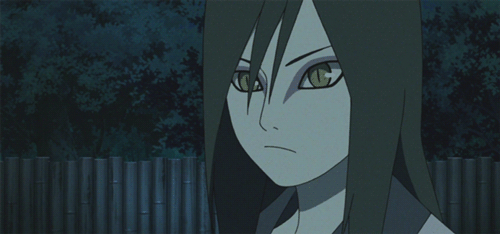

# 🐍 Orochimaru's Curse - Snake Game

<div align="center">
  
</div>


A cinematic, highly interactive Snake game inspired by the dark aesthetic of **Orochimaru** from the Naruto universe. Built entirely with vanilla web technologies, this project focuses on smooth grid physics, custom cursor tracking, and atmospheric neon styling.

> *"People Really Can Change."* — Orochimaru

##  Live Demo

**Enter the Vessel here:** 🔗 **[https://ashishbtech.github.io/orochimaru-snake-game](#)** 

##  Preview


##  Features

* **Dynamic Difficulty:** Choose between Easy, Medium, and Hard modes to scale the game loop speed dynamically.
* **Atmospheric UI:** A sleek, dark glassmorphism container with deep purple neon dropshadows and an embedded background.
* **Cursed Cursor:** A custom-built, radial-gradient mouse cursor that expands and reacts to interactive elements.
* **Responsive Grid Logic:** Smooth `setTimeout` based movement tracking the snake's coordinates across a 600x600 canvas.
* **Local Storage:** Automatically saves and tracks your High Score across browser sessions.

##  Getting Started

No build tools or heavy frameworks are required. This project runs directly in the browser.

1. Clone the repository:
    ```bash
    git clone [https://github.com/ashishbtech/orochimaru-snake-game.git](https://github.com/ashishbtech/orochimaru-snake-game.git)
    ```
2. Navigate to the project folder:
    ```bash
    cd orochimaru-snake-game
    ```
3. Open `index.html` in any modern web browser.

##  File Structure

* `index.html` - The core layout, canvas structure, difficulty selection, and UI screens.
* `styles.css` - Custom properties, theme colors, responsive media queries, and cursor formatting.
* `script.js` - Real-time game logic, array manipulation for the snake body, collision detection, and DOM events.


##  License

This project is open-source and available under the [MIT License](LICENSE).
